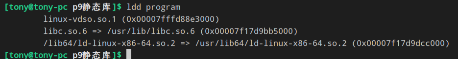

# chapter1UNIX、Linux和GNU简介
## 一、UNIX哲学
### 1.简单
### 2.集中
通常是把小工具组合在一起形成一个新的大型软件


## 二、静态库
### 1.打包库文件


### 2.使用
```bash
$> gcc program.o -L. -lfoo -o program
# -L. 编译器在 . 目录下面查找函数。
# -lfoo 编译器使用名为 libfoo.a 的函数库
```
查看库文件里面包含什么


## 三、动态库(共享库)
### 1.格式
```
/lib/libm.so.N #其中的N表示版本号
eg：
    ld-linux.so.2
```

### 2.查看程序需要的共享库
```bash
$> ldd program
```


其中的 标准C语言函数库(libc)是共享的(.so)，程序需要的版本号是 6 。
