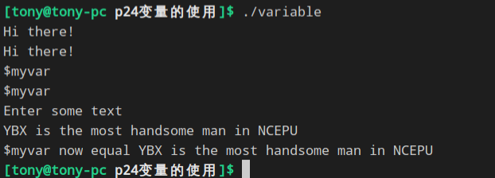
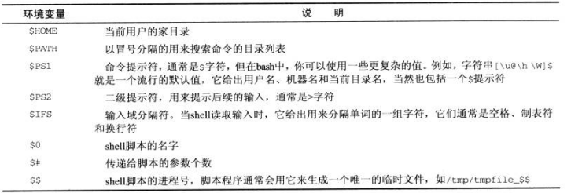
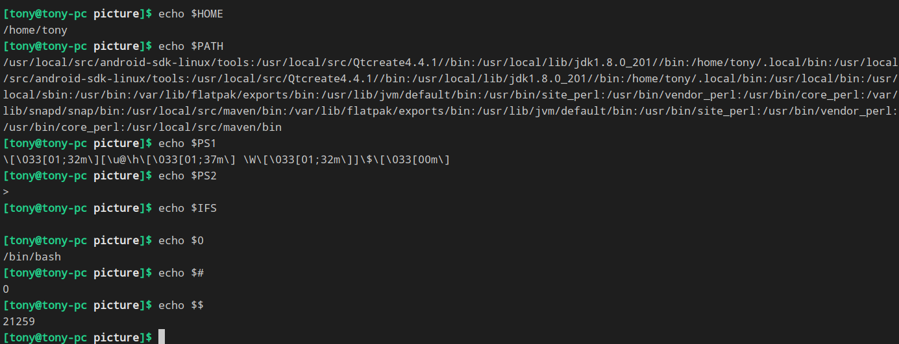
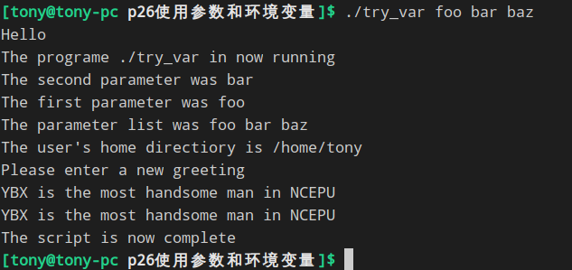
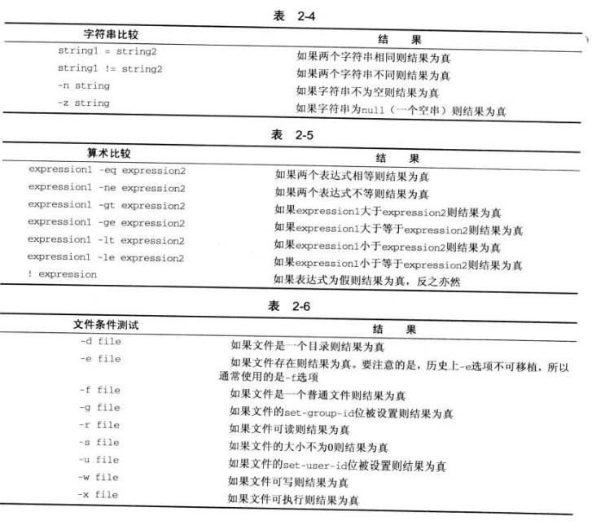
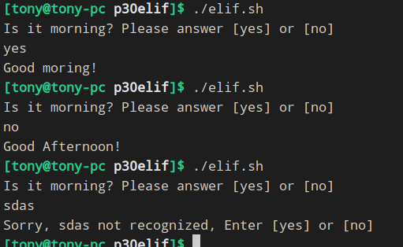
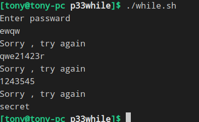

# chapter2Shell程序设计

## 一、[变量的使用](p24变量的使用/variable)


## 二、环境变量




使用参数和环境变量



## 三、条件
所有程序设计语言的基础是对条件进行测试判断，并根据测试结果采取不同行动的能力。

```bash
test或[
```



一般与 if ... else ...elif...结合


## 四、while——C语言中的do...while至少执行1次
```bash
#! /bin/sh 
echo "Enter passward"
read trythis

while [ "$trythis" != "secret" ]; do
	echo "Sorry , try again"
	read trythis
done
exit 0
```


## 五、until——C语言中的while...do可以一次不执行
```bash
#!/bin/sh
until who | grep "$1" > /dev/null
do
	sleep 60
done
```

## 六、case
```bash
case variable in
    pattern [ |pattern] ... ) statements;;
    pattern [ |pattern] ... ) statements;;
    ...
esac

eg：
#!/bin/sh
echo "Is it moring? Please answer yes[y] or no[n]"
read timeofday

case "$timeofday" in
	yes) echo "Good Moring";;
	no) echo "Good Afternoon";;
	y) echo "Good Moring";;
	n) echo "Good Afternoon";;
	*) echo "Sorry, answer not recognized";;
esac

exit 0

######################################
# 等价于
########################################
#! /bin/sh
echo "Is it morning? Please answer yes[y] or no[n]"
read timeofday

case "$timeofday" in
	yes | YES | Yes| y) echo "Good moring!";;
	no | NO | No | n) echo "Good Afternoon!";;
	* ) echo "Sorry, answer not recognized";;
esac

exit 0
```


